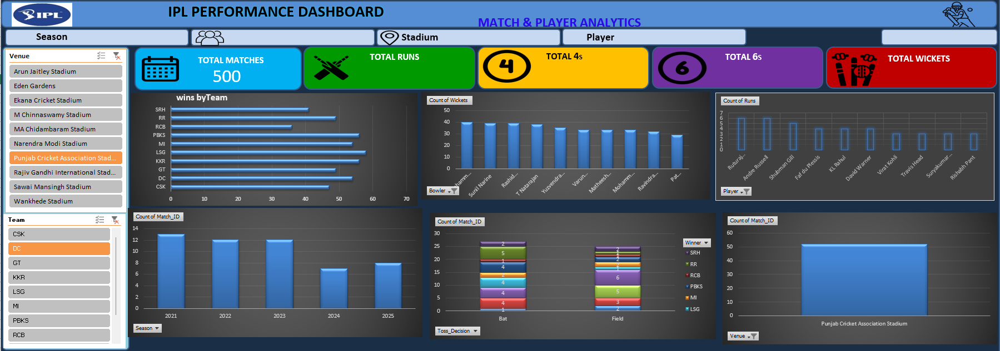

# 🏏 IPL Performance Analysis Dashboard – Excel

A professional Excel-based IPL Performance Analysis Dashboard
designed to analyze team performance, player statistics, match trends,
toss decisions, and venue-level patterns.
This project demonstrates practical Data Analyst skills using
Microsoft Excel, including data organization, KPI creation, Pivot
Tables, chart design, dashboarding, and interactive filtering.

## 📊 Project Overview

The IPL Performance Dashboard converts structured IPL match,
batting, and bowling data into an interactive visual report.

The dashboard focuses on answering questions such as:

How many matches are included in the analysis?

Which teams have the most wins?

Which seasons had the most matches?

Who are the top run scorers?

Who are the top wicket takers?

How does toss decision relate to match outcomes?

Which venues hosted the most matches?

How can the analysis be filtered by season, team, venue, player, or
toss decision?

## 🎯 Objectives

Build a clean and interactive IPL analytics dashboard.

Track important match and player KPIs.

Compare team performance using wins.

Identify top batting and bowling performers.

Analyze seasonal and venue-level match distribution.

Explore the relationship between toss decisions and match winners.

Present insights in a portfolio-ready format.

## 🗂️ Dataset Structure

The workbook contains 500 match-level records and supporting
analytical sheets.

Main Data Sheets

Sheet                               Purpose

Matches                           Match ID, season, date, venue,
teams, toss winner and toss
decision

Batting_Data                      Player, team, runs, balls, fours
and sixes

Bowling_Data                      Bowler, overs, runs conceded,
wickets and economy

Team_Wins                         Aggregated wins by team

Season_Analysis                   Matches by season

Top_Batsmen                       Top 10 run scorers

Top_Bowlers                       Top 10 wicket takers

Dashboard_KPIs                    KPI calculations

pivot table2                      Pivot-based analysis tables

Dashboard_Plan                    Dashboard design and chart plan

## 🔢 Key KPIs

The dashboard includes five primary KPI cards:

Total Matches: 500

Total Runs: 2,960

Total 4s: 260

Total 6s: 155

Total Wickets: 1,222

These KPIs provide a quick overview of the dataset and update the
analytical view based on the underlying Excel calculations.

## 🏆 Team Performance

The team-wins analysis highlights the most successful teams in the
dataset.

Rank Team     Wins

   1 LSG        58
   2 KKR        56
   3 PBKS       56
   4 DC         54
   5 MI         54
   6 GT         49
   7 RR         49
   8 CSK        47
   9 SRH        41
  10 RCB        36

Key observation: LSG leads the team-win analysis with 58 wins in the
dataset.

## 🏏 Top Run Scorers

The dashboard identifies the leading run scorers:

Rank Player                Runs

   1 Ruturaj Gaikwad      1,675
   2 Abhishek Sharma      1,487
   3 Rohit Sharma         1,414
   4 Suryakumar Yadav     1,358
   5 Travis Head          1,355
   6 Virat Kohli          1,348
   7 KL Rahul             1,347
   8 Shubman Gill         1,330
   9 Sunil Narine         1,251
  10 Andre Russell        1,195

Top performer: Ruturaj Gaikwad leads the dataset with 1,675 runs.

## 🎯 Top Wicket Takers

The bowling analysis highlights the leading wicket takers:

Rank Bowler                  Wickets

   1 Sunil Narine                110
   2 Mohammed Siraj              103
   3 Rashid Khan                 100
   4 Mohammed Shami               99
   5 Yuzvendra Chahal             89
   6 T Natarajan                  86
   7 Ravindra Jadeja              80
   8 Matheesha Pathirana          75
   9 Varun Chakravarthy           73
  10 Pat Cummins                  72

Top performer: Sunil Narine leads the wicket analysis with 110
wickets.

## 📅 Season Analysis

The dataset contains matches across five seasons:

Season   Matches

  2021        95
  2022        95
  2023       121
  2024        91
  2025        98

Highest match count: 2023 with 121 matches.

## 📈 Dashboard Visualizations

The dashboard is structured around the following visuals:

Team Analysis

Wins by Team --- Horizontal Bar Chart

Matches by Season --- Column Chart

Player Analysis

Top 10 Run Scorers --- Horizontal Bar Chart

Top 10 Wicket Takers --- Horizontal Bar Chart

Match Analysis

Toss Decision vs Match Winner --- Stacked Column Chart

Matches by Venue --- Bar/Column Chart

Interactive Filters

The dashboard is designed to support slicers for:

Season

Team

Venue

Player

Toss Decision

## 🛠️ Tools & Excel Skills Used

Tools - Microsoft Excel - Pivot Tables - Pivot Charts - Slicers -
Excel formulas - Data visualization

Data Analyst Skills - Data cleaning and organization - KPI
development - Aggregation - Trend analysis - Comparative analysis -
Dashboard design - Business-style insight generation

## 📐 Dashboard Design

The dashboard follows a simple analyst-style structure:

              🏏 IPL PERFORMANCE DASHBOARD

       Season | Team | Venue | Player | Toss

 ┌──────────┐ ┌──────────┐ ┌──────────┐ ┌──────────┐
 │ MATCHES  │ │   RUNS   │ │    4s    │ │    6s    │
 └──────────┘ └──────────┘ └──────────┘ └──────────┘

 ┌──────────────────────┐ ┌──────────────────────┐
 │    WINS BY TEAM      │ │   MATCHES BY SEASON  │
 │     Bar Chart        │ │    Column Chart      │
 └──────────────────────┘ └──────────────────────┘

 ┌──────────────────────┐ ┌──────────────────────┐
 │ TOP 10 RUN SCORERS   │ │ TOP 10 WICKET TAKERS │
 │     Bar Chart        │ │     Bar Chart        │
 └──────────────────────┘ └──────────────────────┘

 ┌──────────────────────┐ ┌──────────────────────┐
 │ TOSS vs MATCH WINNER │ │  MATCHES BY VENUE    │
 │   Stacked Chart      │ │     Bar Chart        │
 └──────────────────────┘ └──────────────────────┘

## 💡 Key Insights

LSG has the highest number of wins in the team analysis.

Ruturaj Gaikwad is the leading run scorer.

Sunil Narine is the leading wicket taker.

2023 has the highest number of matches in the season analysis.

Toss decisions are analyzed against match winners to identify
possible patterns.

Venue-level analysis helps identify locations with higher match
frequency.

## 🚀 How to Use

Download IPL_Analysis_Dashboard.xlsx.

Open the workbook in Microsoft Excel.

Go to the main dashboard sheet.

Use the available slicers/filters to explore the data.

Select different seasons, teams, venues, players, or toss decisions.

Review the KPI cards and charts to identify performance trends.

## 📁 Project Files

IPL-Analysis/
│
├── IPL_Analysis_Dashboard.xlsx
└── README.md

## ⚠️ Data Note

This project is intended as an Excel analytics and dashboarding
portfolio project. The workbook contains structured IPL-style
analytical data for demonstrating dashboard development, KPI analysis,
Pivot Tables, and visualization techniques. Figures shown in this README
are based on the current workbook.

## 👤 Project Type

Portfolio Project --- Data Analytics / Microsoft Excel

Skills Demonstrated

Excel Pivot Tables Pivot Charts Slicers KPI Analysis
Data Visualization Dashboard Design Data Analysis

## 👨‍💻 Created By :

**Ramandeep Pareek** 

Aspiring Data Analyst | Excel | SQL | Python | Power BI

## 🖼️ Dashboard Preview

